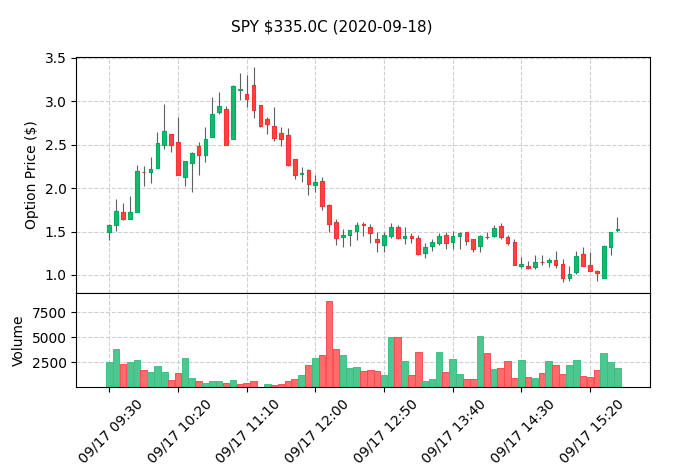
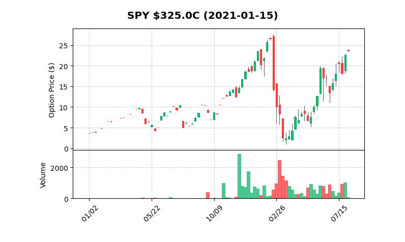

# MySybil Historic Options Data Plotter

This set of scripts aims to provide free access to historic options trade data for anyone that wants it. Whether you want to simply quickly view trade history, or if you want to use these scripts as a starting point to build from, the main hope is to save you time and provide you a small amount of indepence from your broker and any websites trying to make money off of you.

The scripts are plug-and-play from a Python3 CLI, but if you decide to use them on an ongoing basis I do ask that you create your own account at developer.tradier.com and generate your own API token in order to alleviate any potential strain on the communal key provided. It's free, it only takes 30 seconds, and you'll never have to worry about fighting with other users around rate-limiting. 

## Getting Started

These instructions will get you a copy of the project up and running on your local machine.

### Dependencies
```
pandas
requests
```

Note: this package is currently running a custom version of mplfinance with additional personalization options for plots. 

### Run Example

From the CLI run:

```
python3 run_sybil_plotter.py
```

As a quick example, run the script and the first prompt should be to "Enter a symbol to proceed: "

```
Enter: SPY
```

You'll be prompted to enter either calls or puts.

```
Select call options by entering: C
```

The script will download a list of all available options dates and prompt you to enter one.
```
Enter: 2021-01-15
```

You'll be prompted to select a strike.
```
Enter: 325
```

You'll be prompted for the earliest trade data you want to look at:
```
Enter: 2019-01-01
```

The program should download all the data and then display a candlestick chart of the daily trade data. Something along the lines of the figures below (the candlestick binning can be changed in the settings inside the driver file):

SPY Intraday: 


12-Months of SPY 325C (7D binning):


Example Data Output (Daily data):

```

	    Open  High   Low  Close  Volume 
Date                                       
2020-06-18  0.25  0.25  0.25   0.25       5
2020-06-19  0.30  0.30  0.24   0.28      46
2020-06-22  0.34  0.35  0.28   0.28      43
2020-06-23  0.39  0.39  0.26   0.28      41
2020-06-24  0.25  0.27  0.21   0.25      70
2020-06-25  0.19  0.19  0.14   0.15      26
...
...
2020-08-11  1.46  1.57  0.56   0.70   10252
2020-08-12  0.89  2.02  0.64   1.83   12431
2020-08-13  1.96  2.44  1.28   1.33   10453
2020-08-14  1.28  1.83  0.78   0.85   13137
```

## Additional Notes

There is an API key hard-coded into the script, it's totally cool for you to use this while deciding if you want to continue to use this script or not, but there is rate-limiting on it and the potential for that to become a problem. If you do plan to use this script frequently or build on-top of it, please head over to developer.tradier.com and sign up for free for an account and get your own API key.

The mplfinance library is still under development and not-totally stable. I run into issues like having to change the window size of the plots manually to get them to auto-resize. These scripts will include a custom version of the package when required.

## Authors

* **Teddy Rowan** @  MySybil.com

## Acknowledgments

* I would like to thank Tradier for providing free access to their sandbox API to get free historic options quotes.
