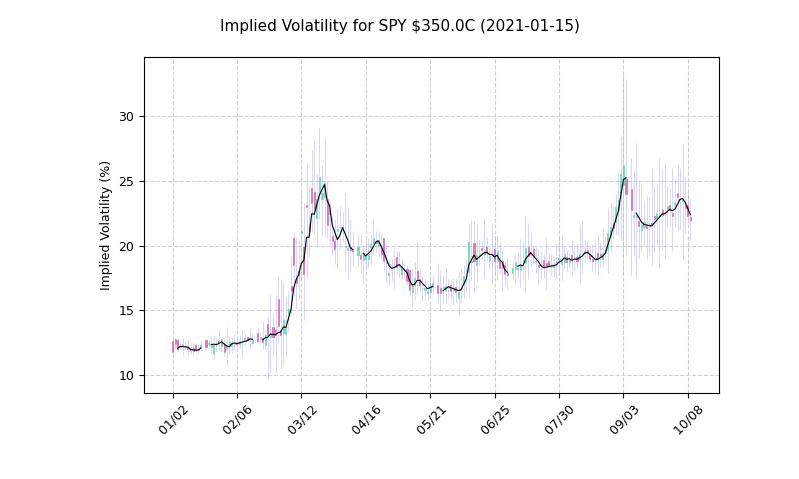

# MySybil's Historic Options Data Plotter

v0.121 : these scripts now also calculate and display historic implied volatility data when you run your standard queries! The plots still need a bit of work but they are functional for now. Check out the implied volatility section at the bottom of this README for clarifications about what the volatility charts represent.

---

This set of scripts aims to provide free access to historic options trade data for anyone that wants it. Whether you want to simply quickly view trade history, or if you want to use these scripts as a starting point to build from, the main hope is to save you time and provide you a small amount of independence from your broker and any websites trying to make money off of you.

The scripts are plug-and-play from a Python3 CLI, but if you decide to use them on an ongoing basis then you should create your own account at developer.tradier.com and generate your own API token in order to alleviate any potential strain on the communal key provided. It's free, it only takes 30 seconds, and you'll never have to worry about fighting with other users around rate-limiting. 

## Getting Started

These instructions will get you a copy of the project up and running on your local machine.

### Dependencies
```
matplotlib
numpy
pandas
requests
scipy
trading_calendars
```

Note: this package is currently running a custom version of mplfinance with additional personalization options for plots. 

### Run Example

From the CLI run:

```
python3 run_sybil_plotter.py
```

As a quick example, run the script and the first prompt should be to "Enter a symbol to proceed: "

```
Enter: SPY
```

You'll be prompted to enter either calls or puts.

```
Select call options by entering: C
```

The script will download a list of all available options dates and prompt you to enter one.
```
Enter: 2021-01-15
```

You'll be prompted to select a strike.
```
Enter: 325
```

You'll be prompted for the earliest trade data you want to look at:
```
Enter: 2019-01-01
```

The program should download all the data and then display a candlestick chart of the daily trade data. Something along the lines of the figures below (the candlestick binning can be changed in the settings inside the driver file):

SPY Intraday: 


SPY Intrady Implied Volatility: 


60 Days of SPY Price History:


A Full Year of SPY Implied Volatility:




Example Data Output (Daily data):

```

             Open   High    Low  Close  Volume  IV (%)
Date                                                  
2020-07-21   4.95   4.95   4.95   4.95       1   44.80
2020-07-22   5.65   5.65   5.65   5.65       1   45.50
2020-07-23    NaN    NaN    NaN    NaN       0     NaN
2020-07-24    NaN    NaN    NaN    NaN       0     NaN
2020-07-27   4.85   4.85   4.85   4.85       3   44.95
2020-07-28    NaN    NaN    NaN    NaN       0     NaN
2020-07-29    NaN    NaN    NaN    NaN       0     NaN
2020-07-30   5.45   5.45   5.45   5.45       1   45.25
2020-07-31   6.00   6.00   5.90   5.90       2   46.71
2020-08-03   6.68   8.86   6.68   8.55     386   47.42
2020-08-04   8.88   9.95   8.88   9.95      14   47.39
...
...
...          Output truncated for README
...
...
2020-09-30  12.50  19.03  12.14  17.50    1573   45.46
2020-10-01  21.25  21.25  15.50  18.32    1452   45.83
2020-10-02  12.90  17.45   8.75   8.75    2446   45.74
2020-10-05  10.80  15.15  10.45  13.95    5426   38.72
2020-10-06  17.05  25.60  14.40  16.55    4529   43.01
2020-10-07  22.15  24.40  17.80  19.50    1009   40.19
2020-10-08  22.00  22.15  14.00  15.57    1524   40.36

```

* Note: the Implied Volatility data that is printed is the 'close' data point. See the note below. 

### Implied Volatility

So what's the deal with the volatility charts? What it comes down to is that to calculate the volatility at the time of the trade you need to know the current price of the underlying stock as well. The data that these scripts get from Tradier is the opening, closing, lowest, and highest price for an option (or stock) during a time period. Since options have inconsistent volume we can't determine when during that period any of the trades took place, so there's going inaccuracy in any volatility that gets calculate. This inaccuracy is small for data with a small interval size, but if we look at daily data for a low volume option then the calculations become unreliable.

To account for this, the script calculates four volatility values for every interval: the opening value (for daily data this would assume that the first option trade is at 9:30 AM), the closing value (this would assume the last option trade is at 4:00 PM), the highest possible volatility, and the lowest possible volatility value. The script then displays this in candles using a traditional OHLC framework. For one-minute intervals the wicks are very small, for daily intervals they are very large. 

**The wick DOES NOT imply that the there was a trade with that implied volatility - only that it is possible that there COULD HAVE BEEN.**

SPY Multi-Year Daily Volatility: 


## Additional Notes

There is an API key hard-coded into the script and it's totally cool for you to use this while deciding if you want to continue to use this script or not, but there is rate-limiting on it and the potential for that to become a problem. If you do plan to use this script frequently or build on-top of it, please head over to developer.tradier.com and sign up for free for an account and get your own API key.

The mplfinance library is still under development and not-totally stable. I run into issues like having to change the window size of the plots manually to get them to auto-resize.

## Authors

* **MySybil.com**  

## Acknowledgments

* I would like to thank Tradier for providing free access to their sandbox API to get free historic options quotes.
